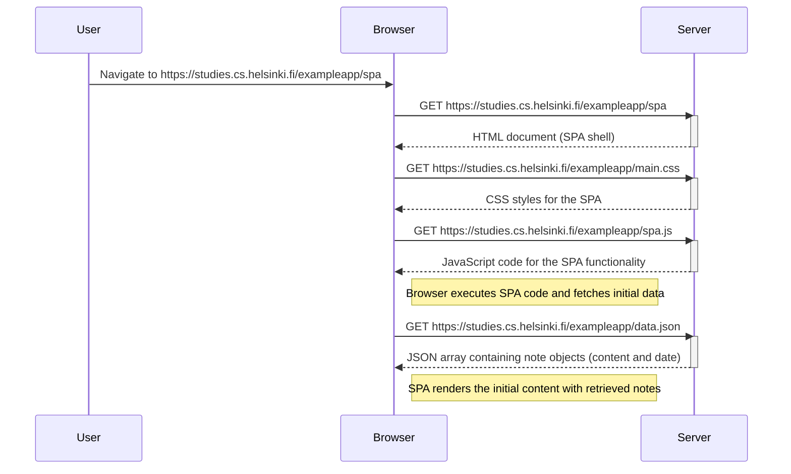

```mermaid

sequenceDiagram
    participant User
    participant Browser
    participant Server

    User->>Browser: Navigate to https://studies.cs.helsinki.fi/exampleapp/spa
    Browser->>Server: GET https://studies.cs.helsinki.fi/exampleapp/spa
    activate Server
    Server-->>Browser: HTML document (SPA shell)
    deactivate Server

    Browser->>Server: GET https://studies.cs.helsinki.fi/exampleapp/main.css
    activate Server
    Server-->>Browser: CSS styles for the SPA
    deactivate Server

    Browser->>Server: GET https://studies.cs.helsinki.fi/exampleapp/spa.js
    activate Server
    Server-->>Browser: JavaScript code for the SPA functionality
    deactivate Server

    Note right of Browser: Browser executes SPA code and fetches initial data

    Browser->>Server: GET https://studies.cs.helsinki.fi/exampleapp/data.json
    activate Server
    Server-->>Browser: JSON array containing note objects (content and date)
    deactivate Server

    Note right of Browser: SPA renders the initial content with retrieved notes

```
