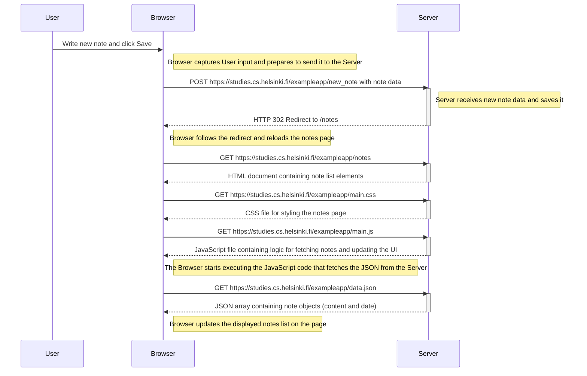

```mermaid
sequenceDiagram
    participant User
    participant Browser
    participant Server

    User->>Browser: Write new note and click Save
    Note right of Browser: Browser captures User input and prepares to send it to the Server

    Browser->>Server: POST https://studies.cs.helsinki.fi/exampleapp/new_note with note data
    activate Server
    Note right of Server: Server receives new note data and saves it
    Server-->>Browser: HTTP 302 Redirect to /notes
    deactivate Server

    Note right of Browser: Browser follows the redirect and reloads the notes page

    Browser->>Server: GET https://studies.cs.helsinki.fi/exampleapp/notes
    activate Server
    Server-->>Browser: HTML document containing note list elements
    deactivate Server

    Browser->>Server: GET https://studies.cs.helsinki.fi/exampleapp/main.css
    activate Server
    Server-->>Browser: CSS file for styling the notes page
    deactivate Server

    Browser->>Server: GET https://studies.cs.helsinki.fi/exampleapp/main.js
    activate Server
    Server-->>Browser: JavaScript file containing logic for fetching notes and updating the UI
    deactivate Server

    Note right of Browser: The Browser starts executing the JavaScript code that fetches the JSON from the Server

    Browser->>Server: GET https://studies.cs.helsinki.fi/exampleapp/data.json
    activate Server
    Server-->>Browser: JSON array containing note objects (content and date)
    deactivate Server

    Note right of Browser: Browser updates the displayed notes list on the page

```
